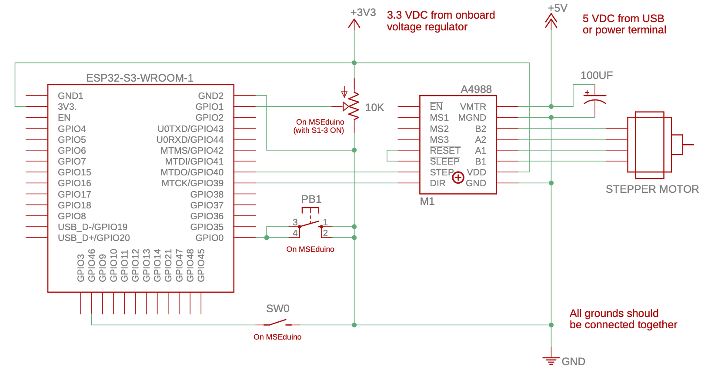

# Stepper Demo

This example shows how a bipolar stepper motor can be used with the MSEduino. It relies on an [A4988 stepper motor driver](https://www.pololu.com/product/1182) to control the flow of current in the motor windings.

__**Before connecting the motor and uploading code, set the current limit by adjusting the small metal potentiometer on the A4988**__. The procedure is demonstrated in [this video](https://www.youtube.com/watch?feature=player_embedded&v=89BHS9hfSUk). To prevent overheating, current to the stepper motor should be approximately 0.16 A or less.

Once the current limit has been set to a safe value, SW0 (S1-2) may be used to turn the stepper motor on and off (enable/disable stepping) and PB1 may be used to change the step direction. The step rate is controlled by the potentiometer.

A [hardware timer](https://docs.espressif.com/projects/arduino-esp32/en/latest/api/timer.html) (Timer 0) is configured to increment every microsecond (1 MHz). A [timer alarm](https://docs.espressif.com/projects/arduino-esp32/en/latest/api/timer.html#timeralarm) is then configured to trigger an interrupt every time the timer equals a preset value. The preset value is determined by the analog-to-digital converted value of the potentiometer. When enabled, the timer ISR toggles the step pin of the A4988, which increments the stepper motor one step for every low to high transition of the step signal. Therefore, two timer interrupts are required to step the stepper motor once (i.e., the step rate is half of the timer interrupt frequency). 

## Hardware Required

For this demo, you will require the following components:

* MSEduino ESP32-S3 based development board
* Bipolar stepper motor
* A4988 stepper motor driver
* 100 µF electrolytic capacitor
* Jumper or Dupont wires (M–F) to connect components

### Library Installation

In order to compile properly, the code in this repository requires the following library to be installed:

#### Adafruit NeoPixel

The [Adafruit NeoPixel Library](https://github.com/adafruit/Adafruit_NeoPixel) is a third-party library that can be installed directly from the Arduino IDE Library Manager. Go to **Tools→Manage Libraries...**. Use the search box to find and install the AdaFruit NeoPixel library.

## Resources

* [Arduino Language Reference](https://www.arduino.cc/reference/en/)
* [Allegro A4988 Stepper Motor Driver Datasheet](https://www.pololu.com/file/0J450/A4988.pdf)
* [A4988 Stepper Motor Driver Carrier](https://www.pololu.com/product/1182)
* [Setting the current limit on A4988 (video)](https://www.youtube.com/watch?feature=player_embedded&v=89BHS9hfSUk)
